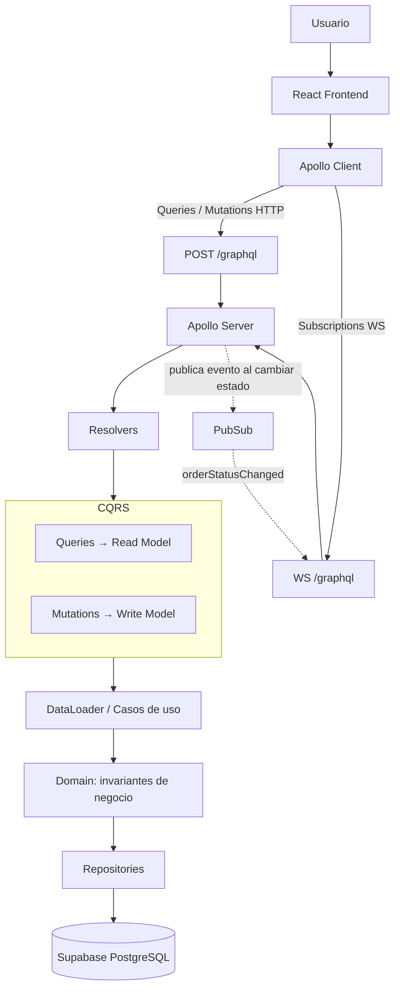

# Afirmative Pill

E-commerce farmacéutico académico construido con **GraphQL (Zero-REST)**,
arquitectura **CQRS**, **DataLoader** y **Subscriptions** en tiempo real,
sobre **Supabase/PostgreSQL**.

## Descripción

Afirmative Pill permite a un usuario explorar un catálogo de 50
medicamentos, agregar productos a un carrito, validar una fórmula
médica cuando corresponde, emitir una orden y hacer seguimiento de su
estado en tiempo real — todo comunicándose **exclusivamente por
GraphQL**, sin un solo endpoint REST.

## Tecnologías

- React + Vite (frontend)
- Apollo Client (queries, mutations, subscriptions)
- Node.js + Apollo Server (backend)
- GraphQL (schema tipado, Zero-REST)
- Supabase / PostgreSQL
- DataLoader (solución al problema N+1)
- TypeScript en ambos lados

## Arquitectura

```text
React
  ↓
Apollo Client
  ↓
GraphQL  (POST /graphql — único endpoint)
  ↓
Apollo Server
  ↓
Resolvers (delgados, sin lógica de negocio)
  ↓
CQRS
  Queries   → Application/Queries  (Read Model)
  Mutations → Application/Commands (Write Model)
  ↓
Domain (invariantes de negocio)
  ↓
Repositories
  ↓
Supabase PostgreSQL
```

## Diagrama de arquitectura



## CQRS

```text
Queries   → application/queries/*   → NUNCA modifican datos
Mutations → application/commands/*  → representan intenciones de negocio
                                       (createCart, addItemToCart, submitOrder,
                                        validatePrescription, approveOrder, cancelOrder)
```

Las mutations **no** son CRUD genérico (`updateMedication`, `deleteMedication`):
cada una representa una acción de negocio real, con sus propias
validaciones en `domain/rules/orderRules.ts`.

## DataLoader — solución al problema N+1

**Sin DataLoader:** una orden con 4 items dispara 4 consultas
individuales `SELECT * FROM medications WHERE id = ?`.

**Con DataLoader:** las 4 resoluciones de `OrderItem.medication` se
agrupan automáticamente en una sola consulta:
`SELECT * FROM medications WHERE id IN (1,2,3,4)`.

Ver `backend/src/graphql/loaders/medicationLoader.ts`. Los logs en
consola (`[DataLoader] batchLoadFn agrupó...`) permiten demostrarlo en
vivo durante la sustentación.

## Zero-REST

El frontend **no** conoce ninguna URL REST. El único endpoint que
`frontend/src/apollo/client.ts` conoce es `/graphql` (HTTP para
queries/mutations, WebSocket para subscriptions). Puede verificarse en
DevTools → Network, filtrando por `Fetch/XHR` y `WS`.

## Instalación

### Backend

```bash
cd backend
npm install
cp .env.example .env   # completar SUPABASE_URL y SUPABASE_SERVICE_ROLE_KEY
npm run dev
```

Servidor disponible en `http://localhost:4000/graphql`.

### Frontend

```bash
cd frontend
npm install
cp .env.example .env   # normalmente no requiere cambios en local
npm run dev
```

Aplicación disponible en `http://localhost:5173`.

## Variables de entorno

**Backend (`backend/.env`):**
- `SUPABASE_URL` — URL del proyecto Supabase.
- `SUPABASE_SERVICE_ROLE_KEY` — clave de servicio. **Solo se usa en
  backend**; nunca debe llegar al frontend ni a un repositorio público.
- `PORT` — puerto del servidor (por defecto 4000).

**Frontend (`frontend/.env`):**
- `VITE_GRAPHQL_HTTP_URL` — URL del endpoint GraphQL HTTP.
- `VITE_GRAPHQL_WS_URL` — URL del endpoint GraphQL WebSocket.


## Pruebas

Ver [`TESTING.md`](./TESTING.md) para los 12 casos de prueba manuales
que cubren búsqueda, filtros, carrito, compra OTC, compra con fórmula,
validación de stock, subscriptions, DataLoader y verificación de
Zero-REST en DevTools.

## Estructura del proyecto

```text
afirmative-pill/
├── backend/
│   └── src/
│       ├── graphql/        (schema, resolvers, loaders, context)
│       ├── application/    (queries y commands — CQRS)
│       ├── domain/         (entidades, reglas de negocio, errores)
│       └── infrastructure/ (repositorios Supabase)
├── frontend/
│   └── src/
│       ├── apollo/         (cliente Apollo con split HTTP/WS)
│       ├── graphql/        (queries, mutations, subscriptions)
│       ├── components/
│       ├── pages/          (Catálogo, Detalle, Carrito, Checkout, Seguimiento)
│       └── hooks/
├── database/
│   ├── schema.sql
│   ├── rpc_functions.sql
│   └── seed.sql
└── TESTING.md
```
